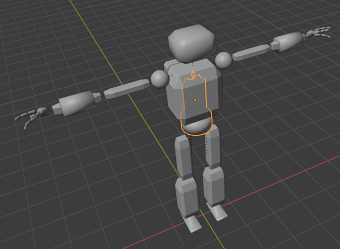
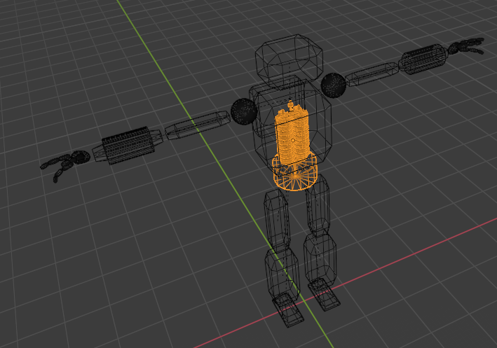
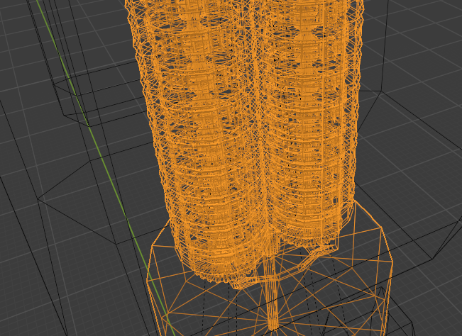
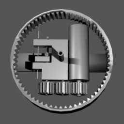
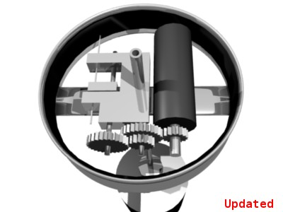
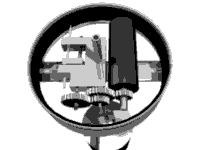
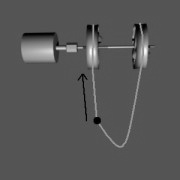
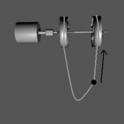

# humanoid-robot

Open-source plans for a "simple as possible", useful, safe and robust robot hardware.  

### This robot should be able to... 
* write or draw as well as a human.
* assemble or disassemble objects for recycling.
* play frisbee as well as a human.
* act as a CNC router using a drill in hand.
* act as a 3D printer with a printer pen in hand.

A good height for the robot might be more or less 4 feet 6 inches tall.

The robot is driven by what I will call an "automatic internal string-puppet engine". An automatic internal string-puppet engine is a CNC device that pulls strings.

"robot_sketch" contains a 3D model sketching how the robot might look. The robot does not have motors distributed through out its body.

The automatic internal string-puppet engine has one large motor which spin discs that can pull strings depending on the state of smaller actuators.

 
